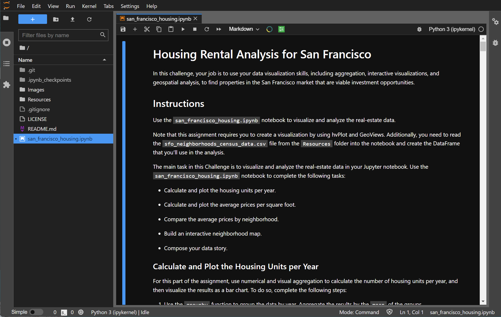

A Jupyter notebook analyzing the average rental prices across San Francisco using data aggregation, visualization, and geospatial analysis.

# Rental Analysis for San Francisco 


Analyzes the housing market of San Francisco using several data visualizations.  The analysis includes a time progression of average rental price vs average sale price by neighborhood, as well as an interactive, geospatial view depicting the average rents and sale prices of the various neighborhoods in San Francisco.  Using these visualizations, the most lucrative investing opportunities can be inferred, as well as areas with growth opportunities.     

---
## Technologies

This project is written using a ```Jupyter Lab 3.2.1``` notebook running  ```Python 3.7.11```.  Key libraries include ```pandas 1.3.5``` for aggregating, analyzing, and sorting the data,```hvplot 0.7.``` for making interactive plots for the data, and ```geoviews 1.9.5``` for making geospatial visualization of the data.

---

## Installation Guide

Before running the application, first install the following packages if you don't already have them installed in your development environment.

```python
  pip install jupyterlab
```
You will also need the PyViz ecosystem, including both hvPlot and GeoViews for the interactive data visualizations.  These PyViz packages can be installed by using the ```conda install``` command:

```python
conda install -c pyviz hvplot geoviews
```
To ensure these packages installed properly, run the following commands in a terminal.  A successful install will provide you with the current version numbers for ```hvplot``` and ```geoviews``` installed on your local machine:
```python
conda list hvplot
conda list geoviews
```

After a successful installation, ```cd``` into the top folder of the repository.  Then open ```Jupyter Lab``` by typing:
```python
jupyter lab
```

The report and analysis are in the jupyter notebook file named ```san_francisco_housing.ipynb```.  

---

## Usage

This Jupyter notebook surveys and analyzes the real estate market in San Francisco and through geospatial visualizaiton, identifies target areas providing the most lucrative opportunites for investment.

To view the jupyter notebook used in this analysis, open up a gitbash or terminal in the top folder of the cloned repository.  Open the ```san_francisco_housing.ipynb``` file, which should look like the displayed version below:




## Data Sources

The SF housing data used in this report is provided in the course materials from a UCBerkeley Fintech Extension program.  

---

## Contributors

The seed code is from the course material from a UCBerkeley Extension program.  This analysis is written and performed by John Gruenewald.<br><br>
For more information, contact **John Gruenewald**:<br>
**e-mail:** [john.h.gruenewald@gmail.com](mailto:john.h.gruenewald@gmail.com)<br> **linked-in:**  [jhgruenewald](https://www.linkedin.com/in/jhgruenewald/)<br>**twitter:**  [@GruenewaldJohn](https://twitter.com/GruenewaldJohn)<br>**medium:**  [@comput99](https://medium.com/@comput99)

---

## License

MIT License

Copyright (c) 2022 John Gruenewald
